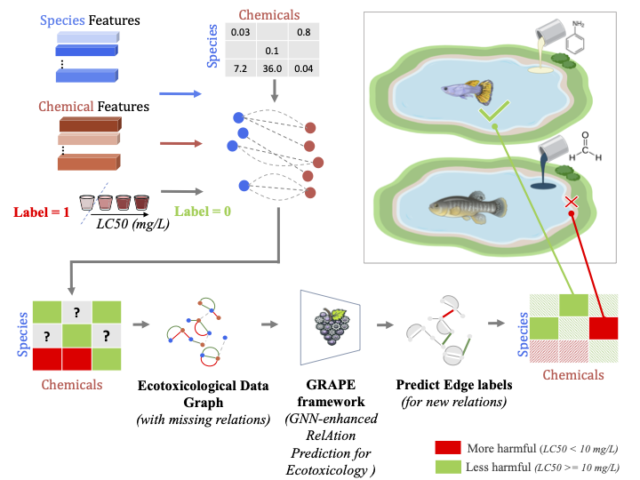

# Graph Neural Networks-enhanced RelAtion Prediction for Ecotoxicology (GRAPE)

This repository contains the code implementation used in the paper [Graph Neural Networks-enhanced RelAtion Prediction for Ecotoxicology (GRAPE)](https://doi.org/10.1016/j.jhazmat.2024.134456) (Journal of Hazardous Materials-May 2024). 



## Abstract 

Exposure to toxic chemicals threatens species and ecosystems. This study introduces a novel approach using Graph Neural Networks (GNNs) to integrate aquatic toxicity data, providing an alternative to complement traditional in vivo ecotoxicity testing. This study pioneers the application of GNN in ecotoxicology by formulating the problem as a relation prediction task. GRAPE’s key innovation lies in simultaneously modelling 444 aquatic species and 2826 chemicals within a graph, leveraging relations from existing datasets where informative species and chemical features are augmented to make informed predictions. Extensive evaluations demonstrate the superiority of GRAPE over Logistic Regression (LR) and Multi-Layer Perceptron (MLP) models, achieving remarkable improvements of up to a 30% increase in recall values. GRAPE consistently outperforms LR and MLP in predicting novel chemicals and new species. In particular, GRAPE showcases substantial enhancements in recall values, with improvements of ≥ 100% for novel chemicals and up to 13% for new species. Specifically, GRAPE correctly predicts the effects of novel chemicals (104 out of 126) and effects on new species (7 out of 8). Moreover, the study highlights the effectiveness of the proposed chemical features and induced network topology through GNN for accurately predicting metallic (74 out of 86) and organic (612 out of 674) chemicals, showcasing the broad applicability and robustness of the GRAPE model in ecotoxicological investigations. 

## Overview
This document provides instructions for running the GRAPE project, which involves predictive modelling in ecotoxicology using graph neural networks (GNNs), multi-layer perceptron (MLP), and logistic regression (LR) models.

### Step 0: Pre-processing
- `0_ecotox_preprocess.py`: Initialize file paths and preprocess raw data (envirotox_20230324.csv, downloaded from [EnviroTox Database](https://envirotoxdatabase.org/)).
  - Set the correct file path for 'ecotox_rawdata_file' in `args_parser.py`.
  - Modify filter conditions to customize experiments (e.g., change from 'LC50' to 'EC50').
  - Specify the output path and filename for the pre-processed file 'ecotox_file' in `args_parser.py`.

### Step 1: Data Preparation
- `1_ecotox_data_prep.py`: Prepare data in the desired format using pre-processed files.
  - Set file paths and filenames for saving species (u) features - 'u_filename_raw' and 'u_filename'.
  - Set file paths and filenames for saving chemicals (u) features - 'v_filename_raw' and 'v_filename'.
  - Configure flags (`args.compute_feats`, `args.save_feats`) and threshold values (`args.conc_threshold`).
  - Set the path and filenames for the 'train_file', 'val_file' and 'test_file' in `args_parser.py` to save train, val and test data.

### Step 2: Model Training and Inferencing
- `2_ecotox_GNN_benchmark.py`: Train GNN models or perform inferencing.
  - Set the `name_str` for model naming and other parameters in `args_parser.py`.
  - Specify model parameters, model folder path, and results folder path.
  - Use `train_flag` to train models (set to 0 for inference).
- `2b_ecotox_MLP_benchmark.py` and `2c_ecotox_LR_benchmark.py` for training MLP and LR models.

## Note
Make sure to set file paths, filenames, and parameters correctly before running the scripts.

## Example Usage
```bash
python 0_ecotox_preprocess.py
python 1_ecotox_data_prep.py
python 2_ecotox_GNN_benchmark.py --name_str 19_02_24_ --train_flag 1 
# Or for inference
python 2_ecotox_GNN_benchmark.py --name_str 19_02_24_ --train_flag 0
```


## Citation

If you find this work useful, please consider citing:

```
@article{anand2024grape,
	author = {Gaurangi Anand and Piotr Koniusz and Anupama Kumar and Lisa A. Golding and Matthew J. Morgan and Peyman Moghadam},
	title = {Graph neural networks-enhanced relation prediction for ecotoxicology (GRAPE)},
	journal = {Journal of Hazardous Materials},
	volume = {472},
	pages = {134456},
	year = {2024},
	issn = {0304-3894}
}
```

### Acknowledgements

This research was partially funded by the Spatiotemporal Activity at the Machine Learning and Artificial Intelligence Future Science Platform (MLAI FSP) and Science Digital at the Commonwealth Scientific and Industrial Research Organisation (CSIRO), Australia. 
